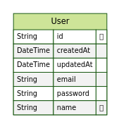

### Food-Shop app

## Installation

1. Clone the repo
2. Install dependencies with `npm install` or `yarn install`
3. Run PostgreSQL server in docker container with `docker-compose up -d`
<!-- 4. Run initialization with `npm run db:reset` -->
<!-- 5. Copy `.env.example` to `.env` and fill in the variables with your own values `cp .env.example .env` -->
6. Run the app with `npm run dev` or `yarn dev`
7. Open [http://localhost:3000](http://localhost:3000) with your browser to see the result.

<!-- ## Entity Relationship Diagram

 -->
